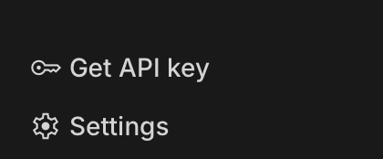
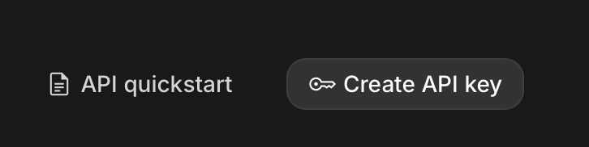
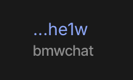
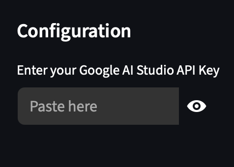

# Setup and Installation

## Option 1: Web-Hosted App

Simply head to this link: [BMWChat](https://bmwchat.streamlit.app)

## Option 2: Local Installation

If you need to run the code locally, follow these steps.

### Prerequisites
* Python 3.9/3.10 (MacOS comes standard with 3.9.6 currently)
* Git

### 1. Clone the Repository
In terminal or command prompt:

```console
git clone https://github.com/ccsjib/bmwgpt.git
cd bmwgpt
```

Alternatively, clone directly into VS Code using the GUI.

### 2. Create a Python Virtual Environment

If running in VS Code, click the search bar > Show and Run Commands > Python: Create Environment and follow the steps to create a new .venv. 

Mac:

```console
python -m venv .venv
source .venv/bin/activate
```


Windows:

```console
python -m venv .venv
.venv\Scripts\activate.bat
```

### 3. Install Required Libraries

```console 
pip install -r requirements.txt
```

### 4. Run App Locally

```console
streamlit run bmw.py
```


## Create and Enter API Key
Once the page loads, locate the Google API Key input box (in the sidebar). 

### 1. Go to Google AI Studio

Click the button in the sidebar of the BMWChat website to reach the Google AI Studio website. Then, click "Get Started" in the top right corner. Follow the instructions to sign in with your Google account.

 


### 2. API Key Menu

Once signed in, click the "Get API Key" button. 

 

### 3. Create API Key

Next, click "Create API Key" in the top right corner.

 

Then, name the key and select the "Default Gemini Project" or create a new one if desired. 

 

Click "Create Key" when finished. 

### 4. Copy Key and Paste on BMWChat

Select the newly created key from the list.

 

In the resulting menu, click "Copy key" to automatically save it to your clipboard.

 

On BMWChat, paste the key into the box in the sidebar. 

 


